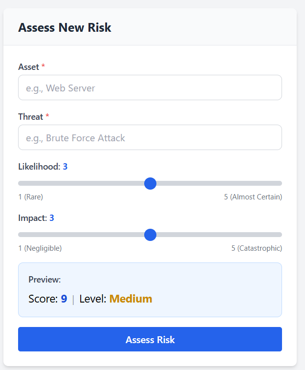
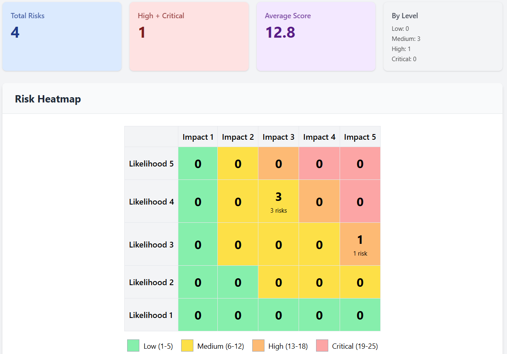
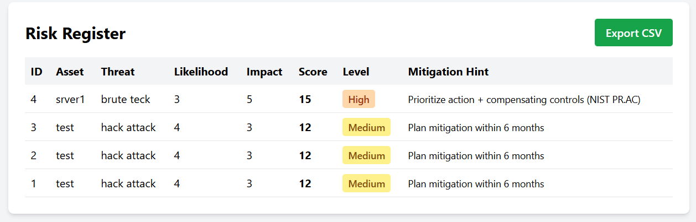

# GRC Risk Assessment Dashboard

This project is a simple full-stack application that demonstrates a core GRC concept: risk assessment using a **likelihood × impact** matrix.
Users can assess risks, store them, and view the results in a dashboard with a table and heatmap.

The goal of this assignment was to focus on correct risk logic, clean APIs, and a usable dashboard, without unnecessary features.

### Features
#### Backend
* FastAPI-based REST API
* Input validation for likelihood and impact (1–5)
* Automatic risk score calculation
* Risk level classification (Low / Medium / High / Critical)
* SQLite database for persistence
* Optional filtering by risk level

#### FrontendReact app using hooks (useState, useEffect)

* Risk input form with real-time score and level preview
* Dashboard with:
  * Risk table (sortable)
  * 5×5 likelihood vs impact heatmap
  * Basic summary stats
* CSV export of risks
* Simple, responsive UI using Tailwind CSS

### Tech Stack
#### Backend
* Python
* FastAPI
* Pydantic
* SQLite
* Uvicorn

#### Frontend
* React
* Axios
* Chart.js (for heatmap visualization)
* Tailwind CSS

### Setup & Run Instructions
#### Prerequisites
* Python 3.9+
* Node.js 16+
* npm

#### Backend
From the project root open a terminal then:
```shell
cd backend

# create and activate virtual environment
python -m venv venv
venv\Scripts\activate   # Windows
# source venv/bin/activate  # Mac/Linux

pip install -r requirements.txt

# start backend
uvicorn app.api.main:app --reload
```
Backend runs at:
```shell
http://localhost:8000
```

#### Frontend
Open a new terminal and run the following commands
```shell
cd frontend
npm install
npm start
```
Frontend runs at:
```shell
http://localhost:3000
```

### Usage
1. Enter asset name and threat
2. Select likelihood and impact (1–5)
3. Preview score and level updates in real time
4. Submit risk
5. View all risks in the dashboard table and heatmap
6. Sort, filter, or export risks as CSV

### Screenshots




### Edge Cases Tested
* Empty database (no risks)
* Boundary values (1×1, 5×5)
* Duplicate risks (allowed)
* Invalid likelihood/impact values
* Large number of risks (50+)

### Assumptions
* No authentication or multi-user support
* Single-user, local usage
* SQLite is sufficient for assignment scope
* No cloud deployment required
* Client-side filtering is acceptable

### Bonus Work Done
* CSV export of risk register
* Heatmap visualization
* Clean architecture separation in backend

### Author
Parveen Chauhan \
Email: parveenchauhan.iitd@gmail.com